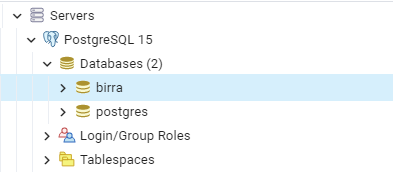

# PostgreSQL y PGAdmin

Bienvenido a la pequeña guía para instalar PostgreSQL junto a pgAdmin (que, por defecto, se instalan juntos y de manera automatica) y algunos pasos de como utilizarlo en tu computadora.   
> _Esta guía va para aquellos que instalan por primera vez PostgreSQL y no necesitan hacer ninguna configuración extra que no sea la por defecto._

### Indice  

- [Instalacion](#instalar-postgresql-y-pgadmin "The best base de datos relacional gratuita")
  - [Windows](#windows "Vamos con windor")
  - [Linux](#linux "El SO que esta en todo")
- [SQL shell](#sql-shell "La Consola de Postgres")
  - [Comandos básicos SQL](#comandos-sql "Algunos comandos")
- [pgAdmin4](#pgadmin "Con interfaz grafica")  
  - [pgAdmin4 en Windows](#configurar-pgadmin-en-windows "windoooor")
  - [pgAdmin4 en Ubuntu](#configurar-pgadmin-en-ubuntu "Ubuntu!")

## Instalar PostgreSQL y pgAdmin


Por si no quieres ver el video, a continuación te dejo los pasos, paso por paso.  

> 1. Ir a la pagina oficial de [PostgreSQL](https://www.postgresql.org/ "Haz click aquí para ir a la pagina"). 
> 2. Cliquear el boton "Download" o "Descargar" _(Esto te dirigirá a las opciones de descarga)_
> 3. Ahora vas a instalarlo
> ### ___Windows___
>> a. Si tienes Windows, aqui tienes la [guía para windows](./windows.md)
> ### ___Linux___ 
>> b. Si tienes Linux, aquí tienes la [guía de linux](./linux.md)  
>> _Cabe aclarar que tanto **Postgres** como **pgAdmin** tienen documentación para instalar y los comandos necesarios para configurar su instalación en la distro que utilices_
>4. Y listo, ya tenés instalado PostgreSQL y pgAdmin para que empieces a utilizar la base de datos.

## SQL shell

SQL shell es la consola de PostgreSQL, en donde podes hacer todos los comandos SQL para manejar tu DB.  
Ésta consola se instala junto con PostgreSQL, aunque también, si hiciste los pasos de path, puedes acceder a esta consola desde cualquier otra consola con el comando  

```
psql -U postgres -h localhost -W
```

>_(con este comando, te pedira la contraseña que usaste anterior mente que te recomendé anotar y que sea sencilla)_

> _En **linux**, no existe sql shell. Simplemente entras a postrges por medio de la terminal de ubuntu con el siguiente comando_
>```
> sudo -u postgres psql
>```
> _No te pedirá contraseña ni nada. Pero si deberas definirle una para futuras conexiones y tambien para utilizar pgAdmin_


Al ingresar a la consola de SQL shell te pedira una serie de datos, a lo que será mejor que vayas dando enter hasta que te pida tu _contraseña_.  

>_No te preocupes si no ves que estas escribiendo la contraseña, eso es a proposito_

Una vez la termines de escribir, presiona la tecla enter y habrás entrado.  
Ahora dependes de tus conocimientos de comandos SQL para crear la base de datos y tablas y demas. Te recomiendo investigar un poco para ver algunos comandos SQL y practicar.  

A continuación te dejo un par de comandos para que crees tu base de datos y poder ver las tablas. 
> ___Son comandos basicos. Recomiendo estudiar SQL si lo van a utilizar___

>### Comandos SQL
>
> Recordatorio: _Para que se ejecuten los comandos, **SI O SI** el comando debe terminar con ";"(punto y coma)_
>
>```SQL
> Comando --> Funcionalidad 
> \q --> Salir de psql o SQL shell 
> \l --> Enlista todas las DB en tu PostgresSQL
> \c [nombre_DB]--> Conecta con la base de datos [nombre_DB]
> \dn --> Enlista todos los esquemas
>
>
>CREATE DATABASE [nombre] --> Crea una base de datos llamada [nombre]
>
>CREATE TABLE [nombre] --> Crea una tabla con llamada [nombre]
>(
>nombre_columna_1 tipo_de_dato(tamaño), --> tamaño no siempre es necesario.
>nombre_columna_2 tipo_de_dato(tamaño), --> un caso necesario es en
>nombre_columna_3 tipo_de_dato(tamaño), --> dato tipo varchar. Lista al final
>);
>
>INSERT INTO [nombre_tabla] (nombre_columna1, nombre_columna2, ...) --> Inertar una
>VALUES (valor_1, valor_2,...); --> fila de valores en la tabla [nombre_tabla]
>           --> cada VALUES esta relacionado con el [nombre_columna] correspondiente 
>
>SELECT nombre_columna --> Te permite obtener la información de [nombre_columna]
>FROM nombre_tabla --> que esta en la [nombre_tabla]
> --> Si se reemplaza nombre_columna por un "*", traera de todas la columnas
> ```
> A partir de ahora, les invito a investigar por ustedes mismos que son las Querys, los metodos ` WHERE, JOIN, ON, etc` y los distintos operadores
>>[PostgreSQL Cheat Sheet](https://www.postgresqltutorial.com/postgresql-cheat-sheet/ "una hoja de 'trampas' con comandos SQL")  
>> Lista de [Datatypes](https://www.techonthenet.com/postgresql/datatypes.php "una lista muy util de Data types con SQL")


## **pgAdmin** 

Otra forma de utilizar la base de datos (y más sencilla), es a través de una herramienta con interfaz grafica, como es pgAdmin.  

Configurar tanto pgAdmin en Windows como en Ubuntu es casi igual. Lo que te voy a explicar a continuacion es esa pequeña diferencia.
> ____
>
>### _configurar pgAdmin en **Windows**_
> - El archivo [windows.md](./windows.md/#pgadmin) tiene, más abajo la explicacion de como configurarlo. Al terminarlo, puedes seguír aquí que en ambos casos es igual.
>
> ____
>
>### _configurar pgAdmin en **Ubuntu**_
> - El archivo [linux.md](./linux.md/#pgadmin) contiene los pasos necesarios para poder configurar pgAdmin4 en Ubuntu. Una vez lo termines, puedes volver aquí para los otros pasos que son exactamente iguales.
>
> ____



Podras ver algo así. Al hacer click derecho en Databases puedes crear una nueva base de datos en "create" --> "Database..." y le das un nombre, etc.

pgAdmin es bastante intuitivo para las cosas. Por ejemplo, si quieres ver los datos de una tabla o la info de una columna, haces el siguiente reccorrido:

> __Databases --> [database name] --> Schemas --> Tables__

y luego seleccionas cualquier tabla con click derecho y le das a la opcion __"View/Edit data"__ y seleccionas una de las opciones

> pgAdmin es bastante sencillo de utilizar.

>
***ESPERO QUE TE HAYA SIDO UTIL ESTA GIA DE INSTALACIÓN Y USO. SIN MÁS, PUEDES PASAR A LA GUÍA DE SEQUELIZE***