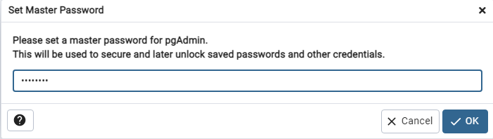

# PostgreSQL y PGAdmin

Bienvenido a la pequeña guía para instalar PostgreSQL junto a pgAdmin (que, por defecto, se instalan juntos y de manera automatica) y algunos pasos de como utilizarlo en tu computadora.   
> _Esta guía va para aquellos que instalan por primera vez PostgreSQL y no necesitan hacer ninguna configuración extra que no sea la por defecto._

### Indice  

- [Instalacion](#instalar-postgresql-y-pgadmin "The best base de datos relacional gratuita")
  - [Windows](#windows "Vamos con windor")
    - [Configuracion del PATH](#lo-que-sigue-no-es-tan-nescesario "variable de entorno")
  - [Linux](#linux)
- [SQL shell](#sql-shell)
  - [Comandos básicos SQL](#comandos-sql)
- [pgAdmin4](#pgadmin)

## Instalar PostgreSQL y pgAdmin


Por si no quieres ver el video, a continuación te dejo los pasos, paso por paso.  

> 1. Ir a la pagina oficial de [PostgreSQL](https://www.postgresql.org/ "Haz click aquí para ir a la pagina"). 
> 2. Cliquear el boton "Download" o "Descargar" _(Esto te dirigirá a las opciones de descarga)_
>> ### ___Windows___  
>>> _Un pequeño video que usé de guía la vez que lo instalé yo_  
>>>[PostgreSQL Instalación en Windows 10- FaztCode](https://www.youtube.com/watch?v=cHGaDfzJyY4)
>>1. Dentro de las opciones de paquetes, seleccionas la opcion que dice _"Windows"_  
>>2. En la nueva pestaña, cliquea en __"Download the installer"__ _(Esto te dirigira  a otra pestaña)_  
>>3. Selecciona la ultima version soportada dentro de la lista de __"Windows x86-64"__ _(Esto te hará descargar el instalador .exe)_  
>>4. Una vez terminó la descarga, ejecutas el instalador
>>>_Es posible que veas que instale Microsoft Visual C++ y otras cosas. Tranqui, que son cosas necesarias para que se instale correctamente_  
>>4. Una vez aparece el instalador, le das a __"Siguiente"__.
>>5. Te aparecerá el directorio donde se instalará. Puedes cambiar esta ruta si o deseas. Le das a __"Siguiente"__  
>>6. Te aparecerán las siguientes opciones tildadas, que son los programas que vas a instalar. _(Recomiendo dejar tildado todo para que se instale y presionar __"Siguiente"__)_
>>>|Opcion|¿Qué es?|
>>>|---|---|
>>>|PosgreSQL Server|El servidor de base de datos como tal|
>>>|pgAdmin 4| Herramienta visual para gestionar las bases de datos de PostrgesSQL. Hace bastante mas sencillo todo|
>>>|Stack Builder| Manejador de paquetes que permite descargar e instalar herramientas y drivers adicionales para PostgreSQL |
>>>|Command Line Tools| Esto debería permitirte ejecutar PostgreSQL desde cualquier consola de windows, sin necesitar de una consola extra o usar PG admin|
>>7. Te aparecerá dode se instalará todo. Cliquea a __"Siguiente"__
>>8. Ahora deberás definir una contraseña. Te recomiendo que la anotes en algun lado, y que no sea algo tan complicado para recordarla facilmente, ya que la utilizaras en todos los __.env__ y tambien cuando tengas que ingresar desde __pgAdmin__ o desde __SQLshell__. Cliqueas __"Siguiente"__
>>9. En el siguiente paso, te muestra el puerto en el que estará corriendo la base de datos, que es aquel que va a estar escuchando todo el tiempo. __Deja el puerto 5432__, no te recomiendo, en lo absoulto, que lo cambies, sumado a que luego, cambiarlo, no será tan sencillo.
>>10. A partir de aquí, le puedes dar a __"Siguiente"__ hasta que te aparezcla la opción __"El programa esta listo para iniciar la instalación"__ que también le darás siguiente y esperaras a que se termine de instalar 
>>11. Una vez finalizada la instalación, el ultimo panel tendra tildado el inicializador de __Stack Builder__. Lo dejas marcado y le das a terminar. Esto permitira que inicie para instalar todos los extras aparte de la base de datos.
>>12. Abierta la pantalla de __Stack Builder__ tendras que seleccionar a que base de datos quieres instalarle los complementos. Seleccionaras la base **PostgreSQL** y le das a __Next >__
>>13. En la lista de aplicaciones a instalar, ***MI*** sugerencia _(al igual que Fazt)_ es que selecciones los complementos en _"Database Drivers"_ si es que trabajas con .NET o Java u otro lenguaje.  
_Si lo deseas, recomiendo investigar sobre las otras opciones_.  
>>14. Darle a _Next >_ siempre, a patir de ahora. Van a instalar estos complementos. Paciencia.  
>> ***Y listo, PostgreSQL ya esta instalado en tu Ordenador***  
>>> ### _Lo que sigue, no es tan nescesario_  
>>15. Lo que sigue es configurar para poder acceder desde cualquier consola. Copias la direccion de la carpeta bin, donde está instalado tu PostgreSQL, que si no cambiaste la ruta, sería algo así `C:\Program Files\PostgreSQL\`__XX__`\bin` siendo __"XX"__ la version de PostgreSQL.  
>>16. Vas al buscador de Windows y escribes __env__ y te aparecera y cliquearas la opción de ***"Editar las variables de entorno del sistema"***. 
>>17. Selecciona la opción __"Variables de entorno"__, luego a la opción __"Path"__ le das doble click. Te abrirá una ventana. Selecciona __"Nuevo"__ y allí pegarás la ruta que copiaste anterior mente.
>>18. Le das a __"Aceptar"__ a las tres ventanas y listo. Configurado para acceder desde cualquier consola.
>
>>### ___Linux___ 
>>> Un video de donde saqué la forma de hacerlo:  
>>>[PostgreSQL, pgAdmin3, Instalación en Linux (Ubuntu y distros similares) - FaztCode](https://www.youtube.com/watch?v=40uGNsi7ysc "FaztCode el mejor")  
>>> Enlace de donde saqué como hacerlo:  
>>>_[How to Install and Set up PostgreSQL Database on Ubuntu 22.04](https://linuxhint.com/install-and-setup-postgresql-database-ubuntu-22-04/ "Instalar PostgreSQL")_  
>>> _[Install PostgreSQL pgAdmin 4 on Ubuntu 22.04 LTS Jammy Linux](https://www.how2shout.com/linux/install-postgresql-pgadmin-4-on-ubuntu-22-04-lts-jammy-linux/ "Instalar pgAdmin 4")_
>>1. <!-- Tarea pendiente -->
> 3. Y listo, ya tenés instalado PostgreSQL y pgAdmin para que empieces a utilizar la base de datos.

## SQL shell

SQL shell es la consola de PostgreSQL, en donde podes hacer todos los comandos SQL para manejar tu DB.  
Ésta consola se instala junto con PostgreSQL, aunque también, si hiciste los pasos de path, puedes acceder a esta consola desde cualquier otra consola con el comando  
```
psql -U postgres -h localhost -W
``` 
>_(con este comando, te pedira la contraseña que usaste anterior mente que te recomendé anotar y que sea sencilla)_

Al ingresar a la consola de SQL shell te pedira una serie de datos, a lo que será mejor que vayas dando enter hasta que te pida tu _contraseña_.  

>_No te preocupes si no ves que estas escribiendo la contraseña, eso es a proposito_

Una vez la termines de escribir, presiona la tecla enter y habrás entrado.  
Ahora dependes de tus conocimientos de comandos SQL para crear la base de datos y tablas y demas. Te recomiendo investigar un poco para ver algunos comandos SQL y practicar.  

A continuación te dejo un par de comandos para que crees tu base de datos y poder ver las tablas. 
> ___Son comandos basicos. Recomiendo estudiar SQL si lo van a utilizar___

>### Comandos SQL
>
> Recordatorio: _Para que se ejecuten los comandos, **SI O SI** el comando debe terminar con ";"(punto y coma)_
>
>```SQL
> Comando --> Funcionalidad 
> \q --> Salir de psql o SQL shell 
> \l --> Enlista todas las DB en tu PostgresSQL
> \c [nombre_DB]--> Conecta con la base de datos [nombre_DB]
> \dn --> Enlista todos los esquemas
>
>
>CREATE DATABASE [nombre] --> Crea una base de datos llamada [nombre]
>
>CREATE TABLE [nombre] --> Crea una tabla con llamada [nombre]
>(
>nombre_columna_1 tipo_de_dato(tamaño), --> tamaño no siempre es necesario.
>nombre_columna_2 tipo_de_dato(tamaño), --> un caso necesario es en
>nombre_columna_3 tipo_de_dato(tamaño), --> dato tipo varchar. Lista al final
>);
>
>INSERT INTO [nombre_tabla] (nombre_columna1, nombre_columna2, ...) --> Inertar una
>VALUES (valor_1, valor_2,...); --> fila de valores en la tabla [nombre_tabla]
>           --> cada VALUES esta relacionado con el [nombre_columna] correspondiente 
>
>SELECT nombre_columna --> Te permite obtener la información de [nombre_columna]
>FROM nombre_tabla --> que esta en la [nombre_tabla]
> --> Si se reemplaza nombre_columna por un "*", traera de todas la columnas
> ```
> A partir de ahora, les invito a investigar por ustedes mismos que son las Querys, los metodos ` WHERE, JOIN, ON, etc` y los distintos operadores
>>[PostgreSQL Cheat Sheet](https://www.postgresqltutorial.com/postgresql-cheat-sheet/ "una hoja de 'trampas' con comandos SQL")  
>> Lista de [Datatypes](https://www.techonthenet.com/postgresql/datatypes.php "una lista muy util de Data types con SQL")


## pgAdmin

Otra forma de utilizar la base de datos (y más sencilla), es a través de una herramienta con interfaz grafica, como es pgAdmin.  

Al ingresar a pgAdmin por primera vez, te va a pedir que definas una **Contraseña** maestra para pgAdming, que te la va a solicitar cada vez que entres.



> _Te sugiero que utilices la misma contraseña que usaste antes, al instalar PostgreSQL. y si es distinta, anótala._  

Una vez definida la contraseña, le das a ✔OK y te vas a cliquearle a donde dice __Servers__

Cuando le cliqueas allí, te aparecerá lo siguiente...


Aquí, te conectarás al servidor de postgres. Colocas la contraseña de usuario postgres que utilizaste al instalar esta DB.  
Colocada la contraseña y dado a OK, ya tienes acceso a tus bases de datos. 
Cliqueas en PostgreSQL y luego en Databases y tendras acceso a todas TUS bases de datos en tu computadora.


Podras ver algo así. Al hacer click derecho en Databases puedes crear una nueva base de datos en "create" --> "Database..." y le das un nombre, etc.

pgAdmin es bastante intuitivo para las cosas. Por ejemplo, si quieres ver los datos de una tabla o la info de una columna, haces el siguiente reccorrido:

> __Databases --> [database name] --> Schemas --> Tables__

y luego seleccionas cualquier tabla con click derecho y le das a la opcion __"View/Edit data"__ y seleccionas una de las opciones

> pgAdmin es bastante sencillo de utilizar.

***ESPERO QUE TE HAYA SIDO UTIL ESTA GIA DE INSTALACIÓN Y USO. SIN MÁS, PUEDES PASAR A LA GUÍA DE SEQUELIZE***