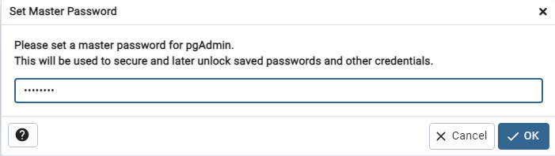
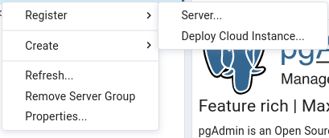
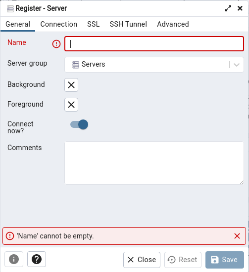
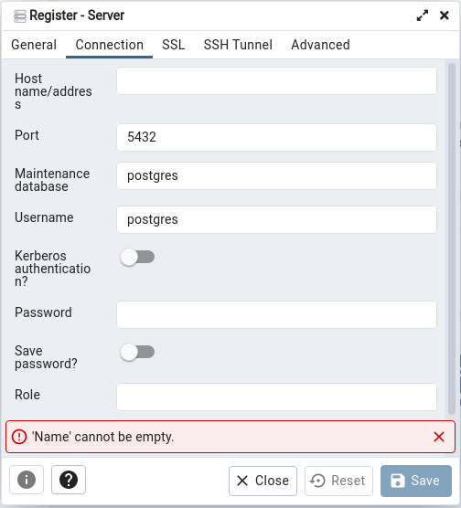

# Linux Ubuntu 

>- Indice
>   - [PostgreSQL](#postgresql)
>   - [pgAdmin](#pgadmin)

>## **PostgreSQL**
>
>> Un video de donde saqué la forma de hacerlo:  
>>[PostgreSQL, pgAdmin3, Instalación en Linux (Ubuntu y distros similares) - FaztCode](https://www.youtube.com/watch?v=40uGNsi7ysc "FaztCode el mejor")  
>_Recomiendo instalar pgAdmin4 en vez de pgAdmin3_  
>> Enlace de donde saqué como hacerlo:  
>>_[Documentación propia de PostgreSQL](https://www.postgresql.org/download/linux/ubuntu/ "Instalar PostgreSQL")_  
>> _[Documentación propia de pgAdmin](https://www.pgadmin.org/download/pgadmin-4-apt/ "Instalar pgAdmin 4")_  
>> Cabe destacar que, si tienes Ubuntu como tal (no una sub-version de ubuntu) Postgres viene instalado por defecto.
>1. Dentro de las opciones de paquetes, seleccionas la que dice "Linux", y luego eliges la distro que tienes.  
> ___Cada una de estas distros, tiene su guía de comandos___  
>2. Abre la terminal de tu distro, y ve copiando y pegando los comandos necesarios para instalar postgreSQL en tu ordenador
>_Te dejo [aquí](https://www.postgresql.org/download/linux/ubuntu/) el enlace donde está la documentacion para ubuntu_
>3. Una vez completados los pasos, primero, limpia tu consola con el comando `clear`. Luego ejecuta el siguiente comando para ingresar a PostgreSQL
>
>```
>sudo -u postgres psql
>```
>
>> Con este comando, entras a postgres directamente con el usuario _"postgres"_ (la parte `-u postgres`) y entras sin contraseña
>4. Una vez adentro, define una contraseña para postgres, así podras entrar luego al servidor desde pgAdmin y tambien cuando necesites hacer las configuraciones con Sequelize. Para ello haz el siguiente comando de postgres
>
>```SQL
>\password postgres [PASSWORD]
>```
>
>> Esto colocara o cambiará la contraseña del usuario **postgres**. Te recomiendo que la contraseña que elijas no sea muy complicada y que la anotes en un papel o algun lado. Esta contraseña la utilizaras en tus **variables de entorno** cuando configures **sequelize** u otra ORM que utilices
>
>5. Ahora puedes salir de la consola, o, si quieres, vuelve a la guía y prueba algunos comandos SQL dentro de postgres para crear una tabla o lo que quieras intentar

___

## **pgAdmin**

>Al ingresar a pgAdmin por primera vez, te va a pedir que definas una **Contraseña** maestra para pgAdming, que te la va a solicitar cada vez que entres.
>
>
>
>> _Te sugiero que utilices la misma contraseña que usaste antes, al camiar la contraseña del usuario postres. Si colocas una distinta, anótala._  
>
>Una vez definida la contraseña, le das a ✔OK y te vas a hacerle click derecho a donde dice __Servers__ y te aparecera lo siguiente  
>
>
>
>Vas a cliquear en la opcion **Register** --> **Server** vas a crear la nueva conexión manualmente de tu servidor de postgres 
>
>
>
> En el nombre de la conexión deberás poner **PostgreSQL** que será con la que conectaras.  
>Luego iras a la opción **Connection** y verás lo siguiente.  
>
>
>
>En **Host name/address** pondras `localhost`, El puerto, username, etc, dejalos como está.   
>En **Password** pondras la contraseña de tu base de datos _(la misma que colocaste antes, cuando le cambiaste la contraseña al usuario postgres, luego de instalar **PostgreSQL**)_  
>Una vez completados los pasos, le das a **Save** y puedes seguir con la guía que está en "README.md", que es exactamente igual lo que sigue. 
