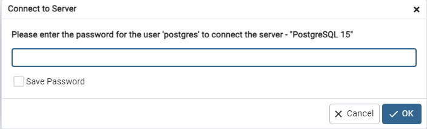

# ___Windows___  

>- Indice  
>   - [PostgreSQL](#postgresql)  
>       - [Ejecuta psql en cualquier consola](#lo-que-sigue-no-es-tan-nescesario)
>   - [pgAdmin](#pgadmin)

## PostgreSQL

>> _Un pequeño video que usé de guía la vez que lo instalé yo_  
>>[PostgreSQL Instalación en Windows 10- FaztCode](https://www.youtube.com/watch?v=cHGaDfzJyY4)
>1. Dentro de las opciones de paquetes, seleccionas la opcion que dice _"Windows"_  
>2. En la nueva pestaña, cliquea en __"Download the installer"__ _(Esto te dirigira  a otra pestaña)_  
>3. Selecciona la ultima version soportada dentro de la lista de __"Windows x86-64"__ _(Esto te hará descargar el instalador .exe)_  
>4. Una vez terminó la descarga, ejecutas el instalador
>>_Es posible que veas que instale Microsoft Visual C++ y otras cosas. Tranqui, que son cosas necesarias para que se instale correctamente_  
>4. Una vez aparece el instalador, le das a __"Siguiente"__.
>5. Te aparecerá el directorio donde se instalará. Puedes cambiar esta ruta si o deseas. Le das a __"Siguiente"__  
>6. Te aparecerán las siguientes opciones tildadas, que son los programas que vas a instalar. _(Recomiendo dejar tildado todo para que se instale y presionar __"Siguiente"__)_
>>|Opcion|¿Qué es?|
>>|---|---|
>>|PosgreSQL Server|El servidor de base de datos como tal|
>>|pgAdmin 4| Herramienta visual para gestionar las bases de datos de PostrgesSQL. Hace bastante mas sencillo todo|
>>|Stack Builder| Manejador de paquetes que permite descargar e instalar herramientas y drivers adicionales para PostgreSQL |
>>|Command Line Tools| Esto debería permitirte ejecutar PostgreSQL desde cualquier consola de windows, sin necesitar de una consola extra o usar PG admin|
>7. Te aparecerá dode se instalará todo. Cliquea a __"Siguiente"__
>8. Ahora deberás definir una contraseña. Te recomiendo que la anotes en algun lado, y que no sea algo tan complicado para recordarla facilmente, ya que la utilizaras en todos los __.env__ y tambien cuando tengas que ingresar desde __pgAdmin__ o desde __SQLshell__. Cliqueas __"Siguiente"__
>9. En el siguiente paso, te muestra el puerto en el que estará corriendo la base de datos, que es aquel que va a estar escuchando todo el tiempo. __Deja el puerto 5432__, no te recomiendo, en lo absoulto, que lo cambies, sumado a que luego, cambiarlo, no será tan sencillo.
>10. A partir de aquí, le puedes dar a __"Siguiente"__ hasta que te aparezcla la opción __"El programa esta listo para iniciar la instalación"__ que también le darás siguiente y esperaras a que se termine de instalar 
>11. Una vez finalizada la instalación, el ultimo panel tendra tildado el inicializador de __Stack Builder__. Lo dejas marcado y le das a terminar. Esto permitira que inicie para instalar todos los extras aparte de la base de datos.
>12. Abierta la pantalla de __Stack Builder__ tendras que seleccionar a que base de datos quieres instalarle los complementos. Seleccionaras la base **PostgreSQL** y le das a __Next >__
>13. En la lista de aplicaciones a instalar, ***MI*** sugerencia _(al igual que Fazt)_ es que selecciones los complementos en _"Database Drivers"_ si es que trabajas con .NET o Java u otro lenguaje.  
>i lo deseas, recomiendo investigar sobre las otras opciones_.  
>14. Darle a _Next >_ siempre, a patir de ahora. Van a instalar estos complementos. Paciencia.  
> ***Y listo, PostgreSQL ya esta instalado en tu Ordenador***  
>> ### _Lo que sigue, no es tan nescesario_  
>15. Lo que sigue es configurar para poder acceder desde cualquier consola. Copias la direccion de la carpeta bin, donde está instalado tu PostgreSQL, que si no cambiaste la ruta, sería algo así `C:\Program Files\PostgreSQL\`__XX__`\bin` siendo __"XX"__ la version de PostgreSQL.  
>16. Vas al buscador de Windows y escribes __env__ y te aparecera y cliquearas la opción de ***"Editar las variables de entorno del sistema"***. 
>17. Selecciona la opción __"Variables de entorno"__, luego a la opción __"Path"__ le das doble click. Te abrirá una ventana. Selecciona __"Nuevo"__ y allí pegarás la ruta que copiaste anterior mente.
>18. Le das a __"Aceptar"__ a las tres ventanas y listo. Configurado para acceder desde cualquier consola.  
>19. Ya puedes seguir con la otra guía

## pgAdmin

>Al ingresar a pgAdmin por primera vez, te va a pedir que definas una **Contraseña** maestra para pgAdming, que te la va a solicitar cada vez que entres.
>
>
>
>> _Te sugiero que utilices la misma contraseña que usaste antes, al instalar PostgreSQL. y si es distinta, anótala._  
>
>Una vez definida la contraseña, le das a ✔OK y te vas a cliquearle a donde dice __Servers__
>
>Cuando le cliqueas allí, te aparecerá lo siguiente...
>
>
>
>Aquí, te conectarás al servidor de postgres. Colocas la contraseña de usuario postgres que utilizaste al instalar esta DB.  
>Colocada la contraseña y dado a OK, ya tienes acceso a tus bases de datos. 
>Cliqueas en PostgreSQL y luego en Databases y tendras acceso a todas TUS bases de datos en tu computadora.
> Ya puedes volver a la otra guía

