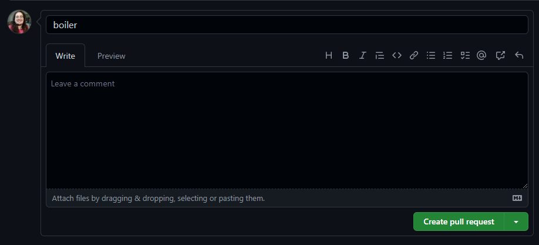
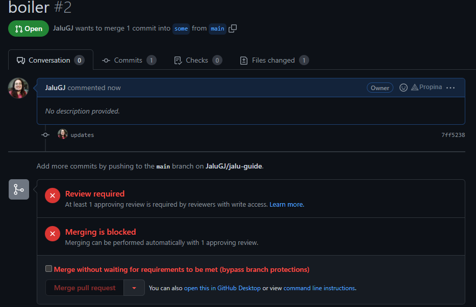
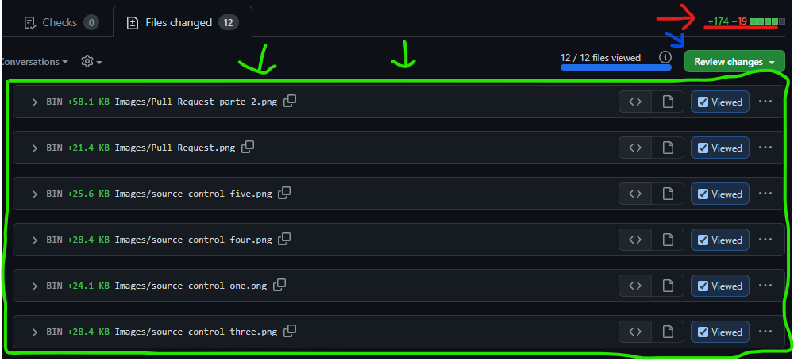
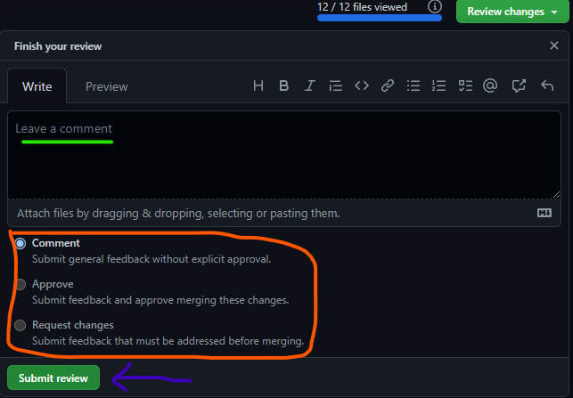

    (si descargaste esto, te recomiendo que lo abras con el preview de VSCode)

>Si este repo les resultó útil, les agradecería que le den una estrellita ⭐ y que lo compartan a quienes creen que les sería util.

# JALU-GUIA DE GITHUB PARA UN PF ORDENADO 

Hola! Este md es una guía practica para las configuraciones rapidas y simples de github junto a comandos, para poder hacer el pf en herny y muchos de estos comandos los utilizaras en el futuro en tu trabajo.  
REITERO, ES UNA GUIA SIMPLE, SE PUEDEN HACER COSAS MAS COMPLEJAS Y TAMBIEN ELEVAR EL NIVEL DE SEGURIDAD. PERO POR AHORA, VAMOS A LOS SIMPLE.

- [Índice](#jalu-guia-de-github-para-un-pf-ordenado "Indice")
  - [Hagamos el repo](#crear-el-repositorio "Vamos a armar el repo y empezarlo")
  - [Añadamos gente](#añadir-miembros-colaboradores-al-repositorio "Vamos que esto se hace en equipo!")
  - [Echamos raices seguras](#crear-ramas-y-protegerlas "Vamos con cuidado")
    - [Creamos ramas](#crear-rama "La semillita para la planta")
    - [Las protegemos](#proteger-rama "Vamos a cuidar nuestro arbolito")
  - [Nos vamos por las ramas](#moverse-por-las-ramas-y-definir-carpetas "Por las ramas, pero enfocados")
    - [Comandos Git](#comando-de-git "Revisable en otros archivos")
    - [El primer Pull request](#pull-request "El primero va sin cuidado")
  - [Hora de trabajar](#hora-de-trabajar "Manos a la obra... o al teclado")
  - [La santa comand-blia](#biblia-de-comandos-para-trabajar "Linus te salve github, lleno eres de comandos, bendito tu eres entre todas las ramas y bendito el proyecto de tu mente, git...")
    - [**Antes** de trabajar](#lo-pasos-que-debemos-hacer-antes-de-empezar-a-trabajar "ANTES DE TRABAJAR, ANTES!!!")
    - [**Despues** de trabajar](#los-pasos-que-debemos-hacer-despues-de-terminar-de-trabajar "APENAS TERMINAN DE TRABAJAR, DE MODIFICAR LO QUE SE PROPUSIERON. COMMITS CHIQUITOS PLIS")
    - [Mezclamos ramas desde github](#mezclar-rama "Me tiembla todo en los mergeos")
  - [Final del README](#felicitaciones-sigan-trabajando "Fin de la guia básica")

 ## Crear el repositorio 

 ---

>_Uno de lo miembros del grupo deberá crear el repositorio de _github_ en donde estará alojado el repositorio._

Entra a github.com y, al lado del menu de su usuario (donde aparece su foto en un pequeño circulo) tienen un simbolo  **"+"** al clickear, ven la opcion de __"new repository"__ el cual los dirije directamente para crear un nuevo repositorio. Le dan un nombre al repositorio. Les recomiendo fuertemente que le den el nombre que va a tener su proyecto, y no "PF-Henry-XX".  
Luego conservan la selección de que sea "public" y **no** añadan ni README file ni .gitignore aun. Esto es para que github les permita  les de los pasos para hacer la clonacion y preparar el repositorio.  
Una vez dado el nombre, le dan a la opcion de "create repositoy" y luego, el dueño del respositorio sigue los pasos indicados para crear el repositorio. Y si, hacer todos los pasos de la primer opcion, desde el comando `echo "# XXX" >> README.md` hasta el ultimo comando `git push -u origin main`

[_Volver al indice_](#jalu-guia-de-github-para-un-pf-ordenado "Índice")

## Añadir miembros _colaboradores_ al repositorio

---

>_Es hora de añadir al equipo de trabajo al repo._

Una vez creado el repo con el nombre del proyecto, deberá dar acceso a modificaciones a sus otros compañeros, para ello, el creador del repo debe ir a la seccion `settings` (o configuración), y a la opcion "collaborators" o "colaboradores".  
Tendran a la vista, un boton verde en el que se lee "Add people", al hacerle click, les aparecerá un modal en el cual les pide el ***nombre de usuario, el nombre completo o el email*** de las personas que seran colaboradores del proyecto.  
En este momento, piden los usuarios de el equipo, y añaden a los colaboradores.

>A los colaboradores les llegara un mail de invitacion para acceder a modificar el repo

Una vez finalizado este paso, es hora de crear las protecciones y las ramas

[_Volver al indice_](#jalu-guia-de-github-para-un-pf-ordenado "Índice")

## Crear Ramas y Protegerlas

---

>_Un buen control sobre las ramas permitira que haya paz en el equipo._

Ya el repositorio esta creado y estan añadidos todos los colaboradores. Si seguiste correctamente los pasos anteriores, tu repositorio debería estar ubicado sobre una rama llamada `main` y ya no debería existir una rama llamada `master`. 
>Si aun tienes una rama llamada master, te recomiendo que hagas los pasos que te indica github para subir un repo ( es decir, la parte de comandos que van desde `echo...` hasta el `git push...`)

[_Volver al indice_](#jalu-guia-de-github-para-un-pf-ordenado "Índice")

### **Crear Rama**

Bien, existen 2 maneras de crear ramas, por `comandos` y a traves de la pagina de `github` en el mismo repo.

>Opcion 1: `Github`
>>+ Hay una barra que dice `<> Code` `⊙ Issues` ... En esta barra, le das a code (si es que no estas en ella ya) y le das a donde dice `branch`, que esta pegadito al lado del cuadrado más claro que dice `main` 
>>+ Una vez adentro, vas a ver la opcion `New Branch` en un cuadrado verde y le haras click. 
>>+ Tras hacerle click aparecerá un modal con un espacio tipo input donde colocar el nombre de la nueva rama. Podran observar que, por encima de ese espacio dice `Branch name`, que significa, nombre de la rama.
>>+ El nombre de la rama deberá ser `dev` (pueden ponerle _development, developer, desarrollo_ o el nombre que ustedes prefieran que tenga que ver con desarrollo, porque en esta rama trabajaran, y deployaran sobre main mas adelante)
>>+ Le dan a la opcion `Create Branch` y *Voilà* lista la rama

>Opcion 2: `comandos`
>+ En la consola de VSCode, (o la que utilicen), desde la carpeta donde tienen el repositorio van a hacer los siguientes comandos
>
>       git branch dev
>       git push -u origin dev
>
>+ Si vuelves a tu github, podras ver, selecionando donde dice `main`, que la rama ya está creada  

[_Volver al indice_](#jalu-guia-de-github-para-un-pf-ordenado "Índice")

### **Proteger Rama**

Ahora, ve nuevamente a la opcion ` ⚙ Settings` y podras ver que en la barra lateral, hay una opcion que dice `Branches` (o _Ramas_). Ve a esa opcion y aqui haremos la proteccion de ramas y tambien cambiaremos cual es la rama default del proyecto (para hacer las cosas más faciles) 

>+ Vamos a cambiar la rama por defecto
>>1. Al final del recuadro donde dice `main` deberías tener un icono con dos flechas, una apuntando hacia la derecha y otra a la izquierda ⇆ (algo asi). Hazle click
>>2. Te aparecera un pequeño modal que te permitira cambiar las ramas. Cliquea donde dice `main`, y selecciona la rama `dev`.
>>3. Le das al recuadro que dice `update` y luego al recuadro de `I understand, update...`
>+ Veras que `main` cambio a `dev`

Vamos a proteger las ramas `main` y `dev`.  
A lo que se refiere proteger las ramas, es que esas ramas no puedan ser sobreescritas en el repositorio, hasta no tener los permisos y autorizaciones de otras personas del equipo, para así no borrar el trabajo que haya hecho otro.  
Los siguientes son los pasos necesarios para proteger una rama (esto deben hacerlo con cada rama que quieran proteger, por separado)

>1. Cliquean el boton que dice `Add rule`
>2. Completan el campo obligatorio que es el nombre de la rama a proteger (`main` o `dev`)
>3. Dentro de las opciones, seleccionan `Require a pull request before mergin` y veran que ya queda seleccionada la opcion __Require approvals__. 
>4. Debajo de la opción require approvals, veran un recuadro que dice __required number of approvals before merging__ en el cual deben definir la cantidad de personas que deben aprobar sus cambios al repo, antes de cambiarlo efectivamente. Mi recomendación es que sean 2 para `main` y 1 para `dev`
>5. Van al final de la pagina y le dan al boton verde que dice `Create`

Y listo, ya tienen protegidas las rutas.

[_Volver al indice_](#jalu-guia-de-github-para-un-pf-ordenado "Índice")

## Moverse por las ramas y definir carpetas

---

>_Trabajar ordenado genera y conserva amistades. Apliquemos buenas practicas y buena comunicación_

### **Comando de Git**

Mi mas sincera recomendación, echenle un vistazo al archivo [folder-boiler-1.md](../boilerplates/folder-boiler-1.md "este lo recomiendo") y [folder-boiler-2.md](../boilerplates/folder-boiler-2.md "este tambien lo recomiendo") son dos estructuras de carpetas que a mi consideración son optimas y buenas practicas. Pueden elegír cualquiera de las dos o ninguna ya que consideran que es mejor otra estructura.  
Una vez que ***ELIGIERON*** la estructura general del carpetas _(es decir, decidieron por una opción, pero todavia no la construyeron)_, uno de los integrantes del grupo (preferentemente quien armó el repo) va a ir a su consola de VSCode donde hizo el repo, y va a escribir los siguientes comandos

    1. git checkout dev
    2. git pull origin dev
    3. git checkout -b boiler
    4. git push -u origin boiler

>***(Podran encontrar un archivo llamado [diccionario.md](../comandos/diccionario.md "ediciones Jalu") en el que explico que hace cada comando, bastante por encima)***
>>_En resumen, lo que hiciste fue moverte a otra rama (llamada boiler, en este caso) para no trabajar sobre dev, y pusiste la rama en el repo_

Luego de hacer estos comandos, se puede comenzar a trabajar. Crearas las carpetas del boiler, instalaras dependencias necesarias, etc (npm y npx)

>En los boilers les dejo un par de recomendaciones de como armarlo con los npm y npx

Una vez que terminaste de trabajar, que armaste el proyecto básico, con el orden de carpetas y algun que otro archivo, toca subir las modificaciones a github. para ello, los comandos que vas a usar seran los siguientes 

>Podes elegir entre usar el source control o hacerlo por comandos

    1. git add .
    2. git commit -m "boiler"
    3. git push 

### **Pull Request**

> _Ahora toca mezclar lo que hiciste con la rama dev, desde github_

Para ello, te vas a ir al repositorio en **Github** y haras el Pull Request de lo que subiste, hacia dev.

Al entrar al repositorio, vas a encontrar un cartel en el que tiene el nombre de la rama que creaste (en nuestro caso, _boiler_)  y al final, en un recuadro verde, hay un cartel que dice `Compare & Pull request`. Le harás click a ese boton, y luego te dirigira hacia otra pantalla en la cual, vas a encontrar otro cartel verde que dice `Create Pull Request`. Tambien le harás click.

>_Por ahora, como eres el administrador del repo, solo tienes que hacer lo siguiente una vez_

Como estas haciendo un pull hacia dev, y anteriormente protegimos a dev, te va a aparecer un dos circulos rojos con una x, indicando que es requerida una review y que el mergeo esta bloqueado. Ya que tu creaste el repositorio, tu y solo tu tienes la posibilidad de saltearte las protecciones, seleccionando la opcion `merge without waiting for requirementes to be met`. 

Lo que haras será tildar esa opcion y cliquear luego el boton `Merge pull request` que te aparecerá en rojo.    
Mas adelante, precisamente en [mezclar rama](#mezclar-rama "Mezclar ramas como se mezcla la masa") vamos a volver al tema para hacer las cosas correctamente.  
Ya, finalizado lo reciente, ahora has subido las carpetas y los archivos de boiler al respositorio. 

>_Importante, para que las carpetas se suban, tal como puse en el boiler, las carpetas tienen que tener al menos un archivo dentro que contenga, porque sino, **no se sube la carpeta**_

[_Volver al indice_](#jalu-guia-de-github-para-un-pf-ordenado "Índice")

## Hora de trabajar

---

>_El trabajo ordenado trae paz a la mente y al equipo, y nos permitira descanzar_

Ahora que el repositorio está subido y actualizado, todos los integrantes del grupo pueden clonar el respositorio en cada una de sus computadoras para comenzar a trabajar.  
Pero, antes de ponerse a trabajar hay unos pasos que es ***NECESARIO*** hacer. Deben seguir la [biblia de comandos](#biblia-de-comandos-para-trabajar "LA SANTISIMA BIBLIA") que, en este [README.md](./README.md "pos... este archivo") la pueden encontrar completa con explicaciones. En el archivo [github-commands.md](../comandos/github-commands.md "los comandos tan necesarios") tendrán la lista sin explicaciones, y en el orden que deben hacerlas.

[_Volver al indice_](#jalu-guia-de-github-para-un-pf-ordenado "Índice")

## Biblia de comandos para trabajar

---

### Lo pasos que debemos hacer ***ANTES*** de empezar a trabajar.

>| Paso | Comando | Funcionalidad | Sugerecias / Info |
>|---:|:---|:---|:---|
>| 1 | ``git checkout dev`` | Te posicionaras sobre la rama `dev` | `checkout` es utilizado para navegar entre las distintas ramas |
>| 2 | `git pull origin dev` | Traeras los ultimos cambios que haya en la rama `dev`, que es donde deberian estar los ulimos cambios hecho por el equipo | `pull`, bien traducido del ingles es "traer/tirar", es utilizado para traer, de donde especifiques, todos los archivos que haya en esa rama o repo|
>| 3 | `git checkout -b` [rama de trabajo]| "`-b`" creará la rama con el nombre que designes, y "`checkout`" te llevara hacia esa rama|*[rama de trabajo]*: sera el nombre de la rama en la que trabajaras. Ponle un nombre significativo |
>| 4 | `git push -u origin` [rama de trabajo]| Sube los archivos que tengas en commit.   "`-u`" incluye la rama que creaste en el pusheo.| Siempre que crees una nueva rama, haz un push on `-u` porque eso subirá la rama. Antes que esto, la rama aún no existe en el repositorio |

**Ahora es tiempo de trabajar**  
***Work in progress •••***  

### Los pasos que debemos hacer ***DESPUES*** de terminar de trabajar  
_Existen dos formas para hacer esto. la otra forma la encuentran en el archivo [source-control.md](./source-control.md "el metodo mas sencillo de add, commit y push")_

> | Paso | Comando | Funcionalidad | Sugerecias / Info |
> |---:|:---|:---|:---|
> | 1 | `git add .` |Esto añadira **todos** los archivos a los cambios momentaneos que luego serán subidos. | Sugiero ir al *soruce control* para corroborar que seran comiteado solo aquellos archivos que nosotros queremos. |
> | 2 | `git commit -m` "[detalle]" | Esta linea de codigo, pasara a almacenar, de forma segura, los archivos que añadiste anteriormente. Esto es guardado en tu directorio git local. | Aquí  vas a guardar como una especie de "captura" de los archivos, sobre la rama en la que has trabajado.   [Aqui](./commit-message.md "Buenas practicas en los mensajes de commits") hay buenas practicas en los mensajes |
> | 3 | `git checkout dev` | Te posicionaras sobre la rama `dev`. | `checkout` es utilizado para navegar entre las distintas ramas. |
> | 4 | `git pull origin dev` | Traeras los ultimos cambios que haya en la rama `dev`, que es donde deberian estar los ulimos cambios hecho por el equipo. | Este paso es **ULTRA** necesario, porque si alguien trabajó y subio cambios mientras trabajabas, aquí te actualizaras. |
> | 5 | `git checkout` [rama de trabajo] | Te posicionaras, nuevamente, sobre la rama en la que estuviste trabajando _(la que creaste anteriormente antes de ponerte a codear)_. | Otro paso muy necesario, porque trabajaste aquí, y tus modificaciones se encuentran en esta rama. |
> | 6 | `git merge dev` | Unirá lo que tienes en la rama `dev` con la rama en la que estas posicionado | Por esto es completamente necesario el 3er y 4to paso. Actualizaras tu rama `dev` y mezclaras lo que hay con lo que hiciste. En caso de conflicto, revisar [merge-conflict.md](./merge-conflict.md "Linus quiera que no pase") |
> | 7 | `git push` | Subirás la rama en la que estas posicionado al repositorio de Github, con todos los archivos modificados | Pueden poner `git push origin` [rama de trabajo] por si les da más confianza |

Terminados estos pasos, es tiempo de ir a github y actualizar la rama `dev` con los cambios que has hecho mientras trabajabas, es decir vas a mezclar ramas.

### Mezclar Rama

>_Oh santo github, porfavor, que no haya conflictos_

Si hicieron todo bien hasta ahora, y siguieton correctamente lo pasos, no deberian tener ningun problema para unir la rama que crearon y en la que trabajaron, con la rama `dev`.  
Lo que sigue es ir hacia el repositorio en Github y existen dos posibilidades.  

1. Que aparezca un cartel que tiene el nombre de la rama que creaste y que al final tenga un recuadro verde que diga `Compare & pull request`
2. Que no aparezca el cartel y debas hacerlo a mano.  

>En el 1er caso, lo que debes hacer es lo mismo que antes. Hacerla Click a `Compare & pull request` y luego tendras un recuadro donde poder escribir texto.  

>En el 2do caso, deberan crear ustedes el pull request a mano. Para ello, se van a la opcion al lado de `⊙ Issues` que se llama `Pull requests` y cliquean la opción **New pull request**.  
>Esto mostrara ahora una barra con lo siguiente |base: dev| ⬅ |compare: dev|
> en la que deberan elegír de **base** a `dev` y en **compare**, la rama donde estuvieron trabajando.  
>
>>_**Base** hace referencia a que rama va a ir y **Compare** es la rama de donde viene_  
>
>Asegurado de que rama a que rama va a ir, cliquean el boton verde `create pull request`

 _A partir de aqui, es igual en ambos casos_

> _Recomiendo fuertemente que escriban que fueron los cambios realizados y dar una breve explicacion de los cambios en ese campo de texto_  
>Tambien recomiendo que revisen de donde hacia donde se mezclan las ramas. Que diga **base:dev** y **compare:**[rama de trabajo] 

Les dejo una imagen para que vean a donde hacer click, y pongan el puntero, unos segundos, sobre la imagen

Luego de dar la breve descripcion y corroborar que tenga titulo, le dan click a `Create pull request`.  
A pesar de que los colaboradores recibirán un mail sobre el pull request, es mejor avisarle a uno de tus compañeros que revisen los cambios. Aquella personas que vayan a aprobar el codigo, deben revisarlo primero y luego aprobarlo.

Una de las personas del equipo, _(cualquiera, menos quien generó el pull request)_ debe aprobar el cambio. Para ello, el colaborador ingresará al repositorio, y entrará a la opción llamada `Pull request` ubicada al costado de `⊙ Issues`.  
Al ingresar, podra divisar que hay una opcion con un logo en verde con el nombre del **título** que colocó el creador del **PR**  
Lo seleccionará y cliqueará en la opción ***"Files Changed"*** en donde podrá ver todos los cambios hechos por la persona que creo el pull request. 

>Recomiendo leer los cambios hechos para tener una noción e idea de que cambios hizo la otra persona, y sobre que archivos.A su vez, corroborar que tanto el nombre de variables y codigo, sigan los estandares propuestos por el grupo.

Luego de revisado los archivos, deberá aprobarlos _(o rechazarlos)_. Para ello, cliqueara el boton verde `review changes` y tildará la opcion **aprove** en caso de aprobarlo, **Request Changes** en caso de rechazarlo y pedir cambios.  

> **Request Changes** no implica que no pueda ser aprobado por otras personas, y sea finalmente unido a la rama `dev`.  

Una vez aprobado, en la opcion **conversation** podran observar que los circulos rojos con una X, han pasado a tener una tilde verde, y la opcion que dice "merge pull request" se ha habilitado con un color verde.  
Cliquean sobre ese boton verde y mergean la rama junto con `dev`.   
Resuelto eso, ya unieron su rama con la de `dev`

[_Volver al indice_](#jalu-guia-de-github-para-un-pf-ordenado "Índice")

# Felicitaciones! Sigan trabajando!

Si este repo les resultó útil, les agradecería que le den una estrellita ⭐ y que lo compartan a quienes creen que les sería util.