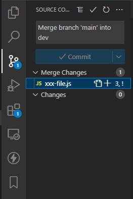
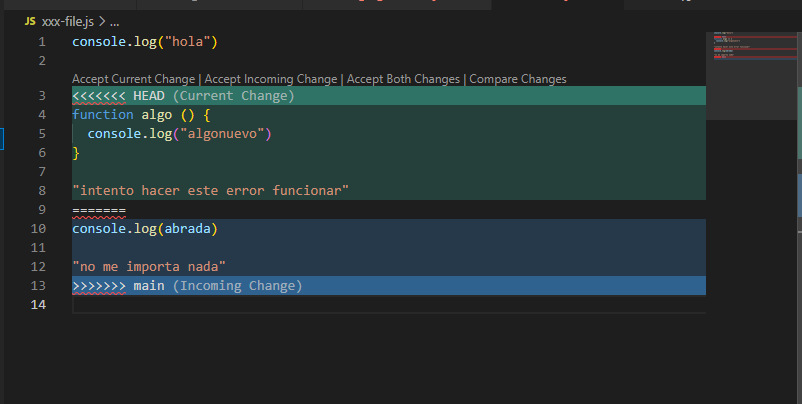
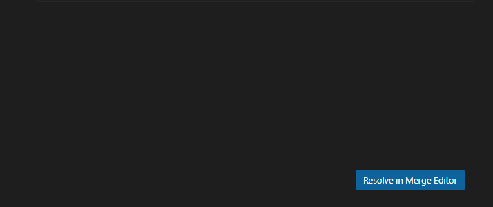
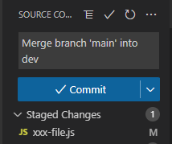
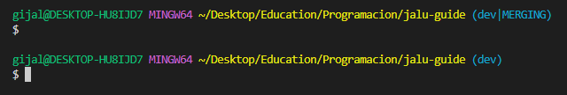

# Si llegaste acá, que no panda el cunico©

Y, aparecio un conflico en el mergeo, luego de hacer `git merge dev` y te apareció, en consola, algo así

```
Auto-mergin xxx_file.js
CONFLICT(content): Merge conflict in xxx_file.js
Automatic merge failed; fix conficts and then commit the result.
```

Quedate tranquilo, que la solución es MUCHISIMO mas facil de lo que crees. Solo que ha que hacer el mergeo manualmente. Y no, no es que tenes que copiar el codigo a mano (aunque a veces si), solo tenes que mezclar las partes que corresponden unir.

Por suerte, nuestro querido VSCode tiene el maravilloso Source Control, y también unos controladores de versionado, que nos permiten hacer el trabajo de unir ambos archivos de una manera mucho mas sencilla. 

## Método 1: Source control y file-comparator



Podremos ver en nuestros archivos en el source control, en la zona de "merge changes" que son los cambios de mergeo.  
Al hacerle click al archivo, se nos abrirá el archivo mostrandonos los conflictos generados.  
Resaltado en __Verde__, podras ver los cambios hechos por tí, es decir, los que se encuentran en la rama que estas **TU**.  
Resaltado en __Azul__, podras ver lo cambios que vienen desde la rama que mergeas. En este caso, como el comando fue `git merge dev`, serán los cambios que trae la rama `dev`

  


Por encima de el recuadro verde, podran ver cuatro opciones  
`Accept Current Change | Accept Incoming Changes | Accept Both Changes | Compare Changes`  
Al aceptar una de ellas, sea la opcion que acepten, reemplazará o unira el codigo.

> _Está muy bien definido que es current y que es incoming en la imagen. Incluso el mismo VSCode te lo muestra_  

Puede suceder que tengas mas de uno de estos cuadritos de cambios, para partes especificas de codigo.  

>_Tambien cabe destacar que, podes utilizar este metodo, o hacer la union bien a mano. Es decir, borrarás este "HEAD" el "main" y corregiras a mano el codigo que está en el medio. Cada quien toma su forma de resolverlo._

Una vez lo resuelves, guardas el archivo y te debería aparecer del siguiente modo en el source-control



podras ver que **YA TIENE UN MENSAJE DE COMMIT**. dejalo tal y como está, y le das click a commit. Una vez commiteado. En tu consola veras que la rama en la que estas tiene un `(rama|MERGING)`. simplemente le daras a enter para que salga del estado de merging y veras lo siguiente (segun la rama y carpeta donde estes)



Una vez hecho el enter, puedes proceder con el git push.

>_Si el `(rama|MERGING)`_ no se va, y queda ahí, es que todavia te quedan archivos con conflictos.

## Método 2: Merge-editor

>Este es otro método para resolver los conflictos. 


Cuando entras, desde el source control, al archivo que está en conflicto (como mostramos en la parte anterior) podras divisar en la parte inferior derecha, un boton que dice **Resolve in Merge Editor** o **Resolver en editor de mergeo**.  
Al hacerle click, podras divisar lo que coloco en la siguiente imagen, que es otro editor de mergeo. Este tiene varias funciones, pero por ahora, veremos las basicas