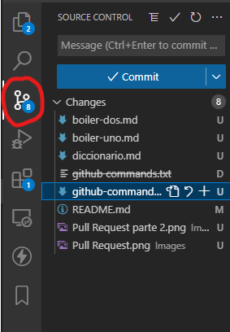
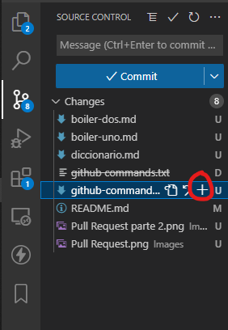
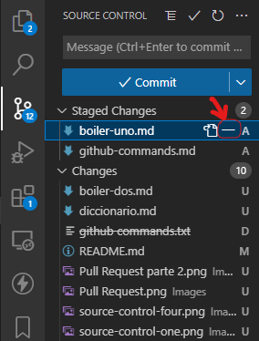
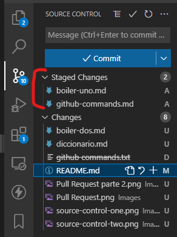
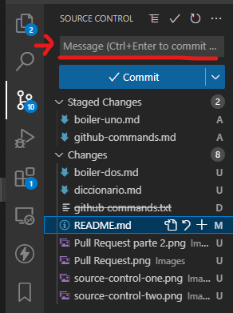

# Source control, el que te ahorra escribir comandos

> - [Indice](#source-control-el-que-te-ahorra-escribir-comandos "indice")
>   - [Source Control](#¿qué-es-y-donde-está-el-source-control "Que es el source control")
>   - [Utilidad](#utilidad "Para que se usa")
>     - [Tablita de letras](#tablita-de-letras-y-sus-significados "y esas letras que son?")
>   - [git add](#remplazo-a-git-add "git add, reemplazado")
>   - [git commit](#remplazo-git-commit--m "git commit, tambien reemplazado")

No a todos les gusta usar el Source control, pero no se dan una idea de lo util que puede ser. Existen alguno personas que se llevan mejor con los comandos, y prefieren el otro metodo.
> Cabe destacar que la explicacion que voy a dar es para el source control que tiene ***Visual Studio Code***

## ¿Qué es y donde está el source control?

El source control es el apartado, la opcion, la sección que te tiene en VSCode para ***Controlar la fuente*** (traducido literal del ingles). Que quiere decir esto, que vas a poder, desde acá, controlar los fuente de codigo que tengas en un repositorio remoto. Podes controlar que envias y que no envias, y controlas los archivos que tenes esperando o no, para ser subidos. 
Es un metodo mucho mas comodo y visual que estar haciendo los comandos de git.  

Si te preguntas Dónde está, pues... se ubica en la barra lateral izquierda, debajo del icono lupa. La imagen a continuacíon muestra su ubicacion en un "circulo" rojo.  
  
_Pueden observar que el logo es reconocible, es como un cuatro al revés con circulos en las puntas_

Al hacerle click, se les va a abrir el panelcito de source control y desde aquí pueden hacer los add, los commits e incluso los push! Sumado a que, desde acá pueden ver comparar los cambios entre lo que esta mas antiguo en la rama y las nuevas modificaciones de hechas por ustedes (arbol de trabajo) 

## Utilidad

Lo primero que veras en este panel, si es que no has hecho _ningun_ cambio, será nada. Si nada, porque no modificaste nada y no hay nada que añadir ni revisar. Es como si quisieras hacer un `git add .` y todaviá no hiciste ninguna modificación. 
Ya, cuando hagas un cambio, te van a aparecer (como en la imagen) un archivo, que será aquel que modificaste. Al final de cada archivo pueden aparecer distintas letras. 

## Tablita de letras y sus significados

|Letra   Simbolo|Significado|
|---|---|
| U | _Unstaged_ No hay registro de este archivo, usualmente aparece en archivos nuevos a añadir|
| D | _Deleted_ Los archivos con la letra D, han sido eliminados |
| M | _Modified_ Es decir, fue modificado y aun no fue subido al repo |
| ! | _Conflict_ Hay conflictos entre este archivo y lo que hay en el repo/rama [Ver resoulcion de conflictos](./merge-conflict.md "Acá vas a encontrar como resolver un conflicto ") |

>A menos que sea conflicto, no es TAN necesario que sepas sobre estos estados... hoy, ahora, que estás haciendo el PF. Tal vez, mañana, es necesario que lo sepas.

## Remplazo a git add

Desde el Source Control, podes hacer el "git add" y el "git rm" simplemente con dos botones. Cuando te colocas sobre uno de los archivos que se encuentra en "changes" o "cambios" y cliqueas el simbolo "+" para añadirlo, o el "-" para quitarlo, como se muestra a continuacion

  

Como podras observar, al añadir un archivo, este ira a una sona de _staged changes_ o _cambios "staged"_, esa zona son los archivos añadidos, listos para hacerles commit.

  

 Y que otra GRAN solucion nos trae el _Source Control_ que nos muestra donde ponemos mensaje de commit y con un simple boton, hacemos el commit.

## Remplazo git commit -m ""

  

Una vez finalizado esto, ya podemos hacer los pasos siguientes de `git checkout dev` `git pull origin dev`, etc

[de vuelta al inicio](#source-control-el-que-te-ahorra-escribir-comandos "indice")